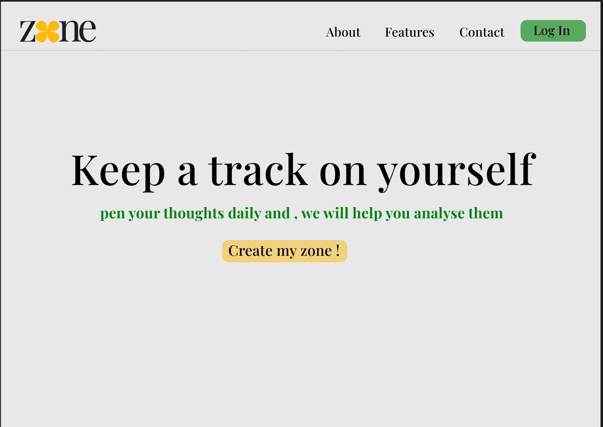

# Zone - Your Personal Mood Tracker

Welcome to Zone, your personal mood logger and emotional well-being companion. Zone empowers you to gain insight into your emotions, track your mood patterns, and improve your mental health. Whether you're looking to enhance your self-awareness, set emotional goals, or simply express your feelings, Zone is here to support you.

## Team members
1. [Sivani L R](https://github.com/sivani-l-r)
2. [Shivani Lekshmi](https://github.com/ShivaniNair2003)
3. [Namitha S](https://github.com/Namitha-S-11465)

## Link to product walkthrough
   [link to video](https://youtu.be/83bHjE0BPW0)

## How it Works ?


## Libraries used
1. vanderSentiment
2. Flask
3. Plotly
   
## How to configure
1. Clone this repository
```
$git clone https://github.com/sivani-l-r/moodtracker.git
```
2. Install the libraries given in requirements.txt
```
$pip install -r requirements.txt
```
   
## How to Run
```
$python app.py
```

## Future Implementation Plans

### Features

- **User-Centric Design**: Zone offers an elegant and user-friendly interface for seamless mood tracking and analysis.

- **Mood Journal**: Record your daily mood, emotions, and thoughts to create a comprehensive picture of your emotional journey.

- **Mood Insights**: Analyze your mood patterns with intuitive visualizations, helping you understand and manage your emotions more effectively (yet to be implemented).

- **Data Security**: Your privacy is our priority. Your mood logs are confidential and only accessible by you.

- **Reminders**: Set reminders to prompt you to log your mood, ensuring consistent emotional self-awareness(yet to be implemented).

- **Customization**: Personalize your mood entries with tags and categories to better capture your unique emotional experiences.

- **Journaling**: Write journal entries to express your thoughts and feelings, fostering deeper self-reflection and understanding.

### Getting Started <a name="getting-started"></a>

To embark on your emotional journey with Zone, follow these simple steps:

1. **Sign Up**: Create a new Zone account using your email and a secure password.

2. **Log In**: After registration, access your personalized dashboard by logging in.

3. **Begin Logging**: Click "Log Mood" to start entering your daily mood, emotions, and notes.

4. **Explore Your Mood**: Dive into the "Mood Analysis" section to visualize and reflect on your emotional history.

## Usage <a name="usage"></a>

### Logging Your Mood

1. Click the "Log Mood" button on your dashboard.

2. Select the date and time for your mood entry.

3. Rate your mood on a scale from 1 (very negative) to 5 (very positive).

4. Add the emotions you're experiencing and any optional notes.

5. Hit "Save" to document your mood.

### Analyzing Mood Trends

1. Navigate to the "Mood Analysis" section to explore insightful charts and graphs representing your mood history.

2. Identify patterns, correlations, and triggers affecting your emotional well-being.

3. Utilize this data to make informed, positive changes in your life.

